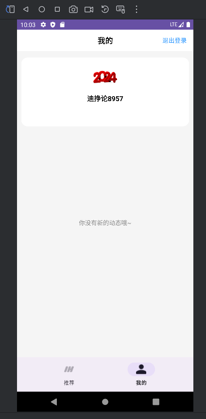
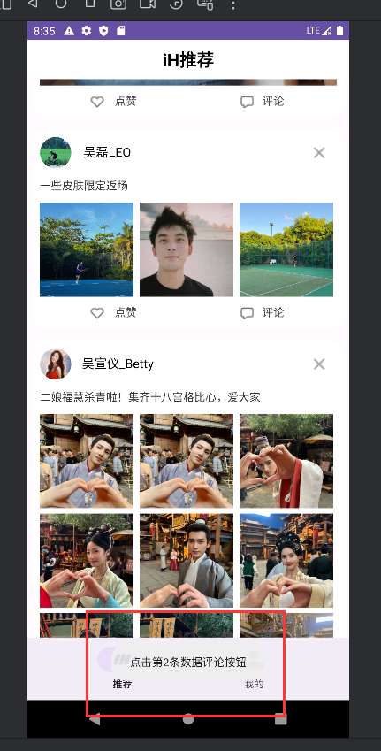

# 小米实践课程说明

## **第一天**
## 演示视频在videos文件夹下，为video_1
声明与条款

用户协议

隐私政策

我的

登录账号

验证码倒计时

错误的验证码

登录成功

个人信息页面

## **第二天** 

## 演示视频在videos文件夹下，为video_2

加载中

推荐页面

视频进度条，可能有点不明显

大图

下拉刷新

九宫格图

无更多内容

点赞

评论

删除帖子

进度条2

网络请求失败

## 第三天  

## 演示视频在videos文件夹下，为video_3，由于模拟器无法完成图片下载，所以图片下载部分用了手机截图和录制。

删除帖子

第一条帖子的评论

第二条帖子的评论

点赞演示

单张图片的大图页面

多张图片的大图页面2/9

多张图片的大图页面3/9

大图页面顶部显示分页、头像、昵称、下载

下载完成

## 项目整体联调
### 功能联调完成后，进⾏布局优化，优化后单独提交
优化后的布局已经只有少部分的过度绘制存在，效果还可以

### 功能联调完成后，检测内存泄漏并进⾏优化，优化后单独提交
--1--
 1 APPLICATION LEAKS
                                                                                                    
    References underlined with "~~~" are likely causes.
    Learn more at https://squ.re/leaks.
    
    2339756 bytes retained by leaking objects
    Displaying only 1 leak trace out of 3 with the same signature
    Signature: 5b8aa14110be8ce47391f276a3045d805591d2e3
    ┬───
    │ GC Root: System class
    │
    ├─ android.net.ConnectivityManager class
    │    Leaking: NO (a class is never leaking)
    │    ↓ static ConnectivityManager.sCallbacks
    │                                 ~~~~~~~~~~
    ├─ java.util.HashMap instance
    │    Leaking: UNKNOWN
    │    Retaining 24.1 MB in 84767 objects
    │    ↓ HashMap[instance @344713088 of android.net.NetworkRequest]
    │             ~~~~~~~~~~~~~~~~~~~~~~~~~~~~~~~~~~~~~~~~~~~~~~~~~~~
    ├─ com.example.weibo_panxuqi.fragment.HomeFragment$3 instance
    │    Leaking: UNKNOWN
    │    Retaining 1.0 MB in 8461 objects
    │    Anonymous subclass of android.net.ConnectivityManager$NetworkCallback
    │    ↓ HomeFragment$3.this$0
    │                     ~~~~~~
    ╰→ com.example.weibo_panxuqi.fragment.HomeFragment instance
    ​     Leaking: YES (ObjectWatcher was watching this because com.example.weibo_panxuqi.fragment.HomeFragment received
    ​     Fragment#onDestroy() callback. Conflicts with Fragment.mLifecycleRegistry.state is INITIALIZED)
    ​     Retaining 1.0 MB in 8460 objects
    ​     key = 1a31dc8b-acae-48eb-9af8-5ba2c605743e
    ​     watchDurationMillis = 55745
    ​     retainedDurationMillis = 50744
泄漏发生在 HomeFragment 中注册的 ConnectivityManager.NetworkCallback 对象没有在 HomeFragment 销毁时取消注册。在 HomeFragment 的 onDestroy() 方法中取消网络回调的注册。

--2--

LoginActivity中的CountDownTimer在Activity被销毁后仍然持有对Activity的引用。导致Activity无法被垃圾回收，从而引发内存泄漏。
在LoginActivity的onDestroy()方法中取消CountDownTimer。